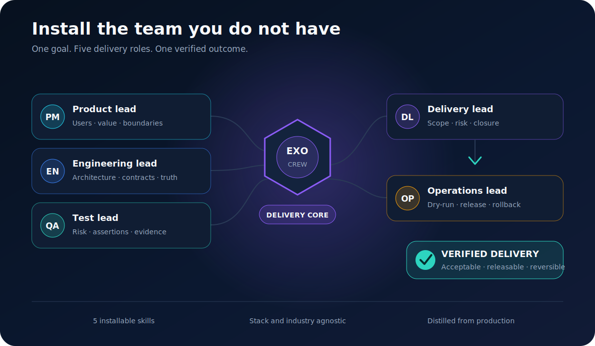
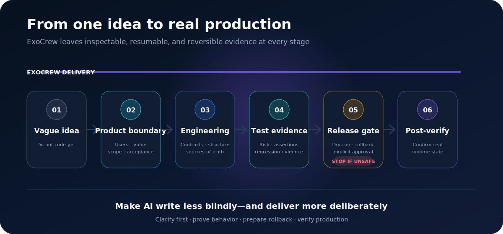
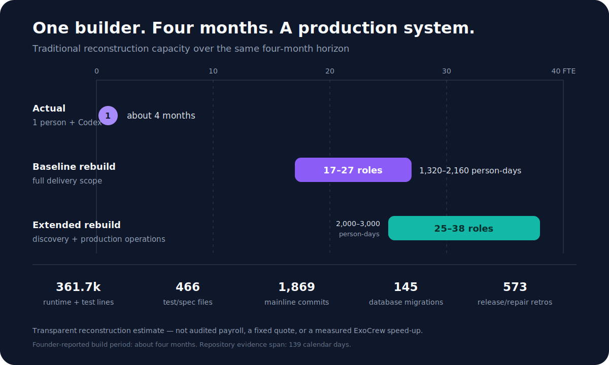

<div align="center">

# ExoCrew

### Zero coding experience? Take a working project from idea to a safe release.

## Do not wait to become a programmer. Give Codex the delivery team it is missing.

**One non-programmer used Codex to drive a complex enterprise operations system into real production in about four months.**

ExoCrew is a Codex-native software-delivery exoskeleton. It packages the hard-won product judgment, engineering guardrails, testing skepticism, and operational discipline learned along the way and installs them into your AI workflow.

**It will not turn a beginner into a programmer overnight. It gives you a complete product, engineering, test, security, and operations method for directing AI to deliver real software from day one.**

<p>
  <a href="https://github.com/denelwu-GH/exocrew/actions/workflows/quality-gates.yml"></a>
  
  
  
  <a href="LICENSE"></a>
</p>

**[Install in 30 seconds](#install-in-30-seconds) · [See idea to production](#from-one-sentence-to-production-a-workflow-beginners-can-control) · [Meet the crew](#six-roles-one-delivery-system) · [简体中文](README.zh-CN.md)**

</div>



<p align="center"><strong>One builder owns the vision. ExoCrew helps AI deliver like a complete team.</strong></p>

## From one sentence to production: a workflow beginners can control

You define the problem and make the important decisions. ExoCrew requires the AI to supply boundaries, evidence, and a way back at every stage.

| Delivery stage | What ExoCrew requires from AI | What you gain |
|---|---|---|
| **1. Software task contract** | Define goals, non-goals, protected behavior, and acceptance criteria | Know what “done” means before work starts |
| **2. Read-only reconnaissance** | Map architecture, dependencies, data flow, and blast radius before editing | Prevent blind changes to a project the AI has not understood |
| **3. Safety boundaries** | Protect secrets, databases, production operations, and external writes | Keep vague instructions from triggering risky actions |
| **4. Minimal implementation** | Find the source of truth, generated files, and migration boundaries; change in stages | Make the smallest correct change without breaking existing behavior |
| **5. Complete testing** | Cover unit, integration, E2E, happy, failure, boundary, and regression cases | Stop treating a green command as proof that the product works |
| **6. Browser acceptance** | Inspect console, network, empty states, error states, and mobile behavior | Verify the real interface, not just the source code |
| **7. Cross-agent review** | Run independent architecture, implementation, test, and security reviews | Reduce the blind spots of one AI approving its own work |
| **8. Git and release** | Inspect status and diffs; create small commits, rollback points, and a release candidate | Keep every change explainable, reviewable, and reversible |
| **9. Production closure** | Deploy, smoke-test, monitor, alert, roll back, and capture lessons | Move from “runs locally” to “owned in production” |

**You do not need to understand every line of code on day one. You do need four answers: what will change, what will not, where the evidence is, and how to get back. ExoCrew makes the AI give you those answers.**

## Making AI write code is not the same as delivering a project

The hard part is not getting AI to produce another page.

The hard part is keeping business boundaries intact, architecture maintainable, tests meaningful, data changes reversible, releases recoverable, and every hard-won decision available to the next task.

**You do not need more generated code. You need a delivery system that lets a beginner judge whether the project is actually ready to ship.**

## Where ExoCrew fits in the AI coding stack

Models provide intelligence. Coding agents execute. Spec-driven frameworks structure intent. CI/CD platforms run pipelines. **ExoCrew governs how work moves from a request to verified, reversible delivery.**


| Tool or category | What it owns | Where ExoCrew fits |
|---|---|---|
| Codex, Claude Code, Cursor, Copilot, OpenCode | Coding-agent execution | The agent acts; ExoCrew supplies delivery coordination plus product, engineering, modernization, test, and operations discipline. The public package is Codex-native today |
| Agent Skills, `AGENTS.md`, Rules, MCP | Context, reusable instructions, and tools | These are mechanisms; ExoCrew is the production-distilled delivery system installed through them |
| [Spec Kit](https://github.com/github/spec-kit), [OpenSpec](https://github.com/Fission-AI/OpenSpec) | Specifications, plans, tasks, and change intent | Keep spec-driven development; add ExoCrew for architecture, evidence, release safety, rollback, and closure |
| [BMAD](https://github.com/bmad-code-org/BMAD-METHOD), [Superpowers](https://github.com/obra/superpowers) | Role-based methods and reusable development workflows | Use their broader methods; use ExoCrew when production delivery gates and cross-functional evidence are the missing layer |
| Harness Engineering, [Harness.io](https://www.harness.io/), GitHub Actions | The full agent system, enterprise delivery platform, and CI/CD execution | ExoCrew is a delivery-discipline layer inside the wider harness; it prepares safer work for the pipeline rather than replacing it |

**[What is an AI coding agent harness?](docs/AI_AGENT_HARNESS.md) · [Full ecosystem comparison](docs/COMPARISON.md)**

## Six roles. One delivery system.

| Role | Skill | What it gives you |
|---|---|---|
| Delivery lead | `exocrew-delivery` | Carries complex work from a vague request to verified closure |
| Product lead | `product-brief` | Makes AI clarify users, value, boundaries, and acceptance before writing |
| Engineering lead | `engineering-guardrails` | Protects architecture, contracts, and sources of truth as the system grows |
| Modernization lead | `system-modernization` | Keeps ports, rewrites, upgrades, parity, extraction, and cutover from becoming endless rework |
| Test lead | `test-evidence` | Turns “it passed” into defensible evidence and catches false-green results |
| Operations lead | `safe-operations` | Gives data changes, migrations, and releases a dry-run, verification, and safe way back |

These are not six chat personalities. They are six executable delivery disciplines.



## Install in 30 seconds

```bash
codex plugin marketplace add denelwu-GH/exocrew
codex plugin add exocrew@exocrew
```

Start a new Codex task, then say:

```text
Use $exocrew-delivery to carry this request from a vague idea to a safe,
verified release. Define the users, boundaries, and acceptance criteria first;
then implement, verify, prepare rollback, and close the work with evidence.
```

For a migration, rewrite, framework upgrade, or public extraction, say:

```text
Use $system-modernization to choose whether this is a port, refactor,
modernization, replacement, or extraction. Preserve the declared contracts,
track readiness and parity, and do not claim cutover readiness without evidence.
```

## Modernize without endless rework

Existing systems fail differently from greenfield projects. “Make it run,” “make it maintainable,” “replace production,” and “publish a clean open-source core” are not the same objective.

`system-modernization` forces that decision before implementation. It then tracks the work from **R0 intent** through local functionality, contract parity, real-environment readiness, cutover preparation, and **R7 production verification**. Route counts and green local tests stay useful evidence—but they cannot masquerade as replacement readiness.

For public extraction, it classifies every source capability as **Keep, Simplify, Pluginize, or Exclude**. For high-risk state changes, the engineering and test roles add a concurrency/race matrix plus an independent adversarial pass, so a first green run cannot hide duplicate execution, cancellation races, rebuild collisions, or missing durable constraints.

**Stop rewriting. Start proving equivalence.**

## Distilled from real production

I am not a programmer.

With Codex, I drove a complex enterprise operations system into real production in about four months. It remains in active enterprise use for day-to-day operations, real data-governance workflows, and business notifications.

The Git evidence spans 139 calendar days and includes 1,869 mainline commits, 25 operator entry points, 401 HTTP operations, 125 data models, and a documented trail of testing, migration, release, rollback, and data-governance work.

The expensive lessons were never just about writing code. They came from business boundaries, architecture drift, false-green tests, historical data, and production releases.

**ExoCrew turns those paid-for lessons into an installable delivery system.**

## Proof behind the story

| Evidence | Audited scale | Evidence | Audited scale |
|---|---:|---|---:|
| Git history span | **139 days** | Mainline commits | **1,869** |
| Runtime + test source | **361.7k lines** | Test/spec files | **466** |
| Hard gates + architecture decisions | **90 + 249** | Runbooks + release/repair retros | **64 + 573** |



A transparent traditional-team reconstruction model estimates the same work surface at **1,320–2,160 person-days**, comparable to **17–27 cross-functional product, engineering, test, and operations roles working over the same roughly four-month horizon**. The modernization lead is an installable responsibility distilled from that work, not an additional headcount claim.

## Built for serious software delivery

ExoCrew is industry-agnostic and technology-stack-agnostic. It is especially useful for:

- solo builders and small teams using AI to ship real products;
- enterprise back-office systems, SaaS, internal tools, and operations platforms;
- projects that have grown from “it runs” into “we cannot afford to improvise”;
- software with real data, database migrations, continuous testing, and production releases.

## More ways to use ExoCrew

<details>
<summary><strong>Install the six skills standalone</strong></summary>

Clone the repository, preview the change, then apply it explicitly:

```bash
node plugins/exocrew/scripts/install-skills.mjs
node plugins/exocrew/scripts/install-skills.mjs --apply
```

Existing skills are not overwritten by default. Explicit `--force` replacements are backed up first.

</details>

<details>
<summary><strong>Bootstrap a governed project</strong></summary>

```bash
node plugins/exocrew/scripts/bootstrap-project.mjs --target ./my-project
node plugins/exocrew/scripts/bootstrap-project.mjs --target ./my-project --apply
```

The starter creates one decision source, current task state, hard constraints, an index, and templates for worklogs, decisions, releases, and lessons.

</details>

## Evidence notes and current boundaries

ExoCrew was distilled from real production delivery. The repository, test, commit, and governance figures above come from a version-bound read-only audit. The traditional-team comparison is a transparent reconstruction model, not audited labor data or a promise of adoption speed-up. ExoCrew does not currently claim a fixed acceleration multiplier, defect-reduction percentage, or headcount replacement; adoption impact will be measured through the public 30-task paired benchmark.

**[Full evidence](docs/EVIDENCE.md) · [Effort model](docs/EFFORT_MODEL.md) · [Benchmark](docs/BENCHMARK.md) · [Architecture](docs/ARCHITECTURE.md) · [Harness guide](docs/AI_AGENT_HARNESS.md) · [Compare](docs/COMPARISON.md)**

---

<div align="center">

### Zero coding experience should not trap you inside a demo that never ships.

## Install ExoCrew in Codex and turn your next sentence into software that runs, verifies, and ships.

**[Install in 30 seconds](#install-in-30-seconds) · [Meet the crew](#six-roles-one-delivery-system) · [Star ExoCrew](https://github.com/denelwu-GH/exocrew)**

MIT License

</div>
