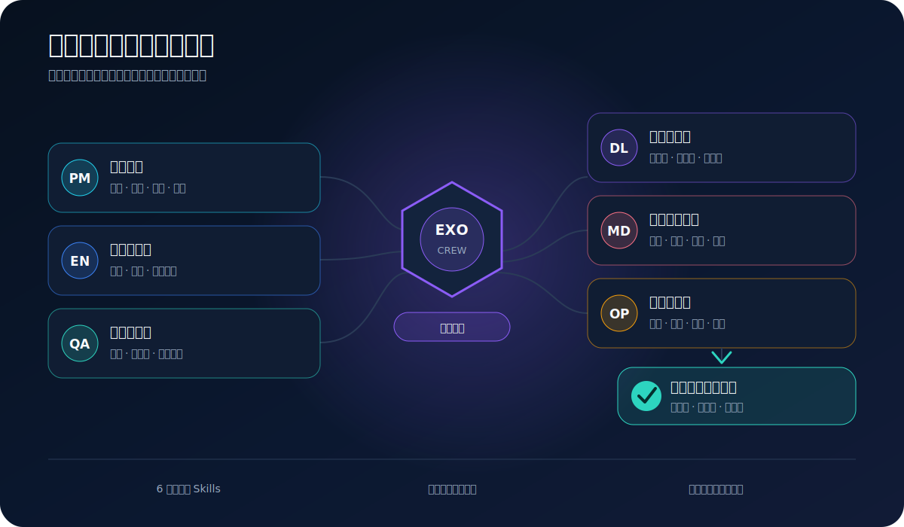
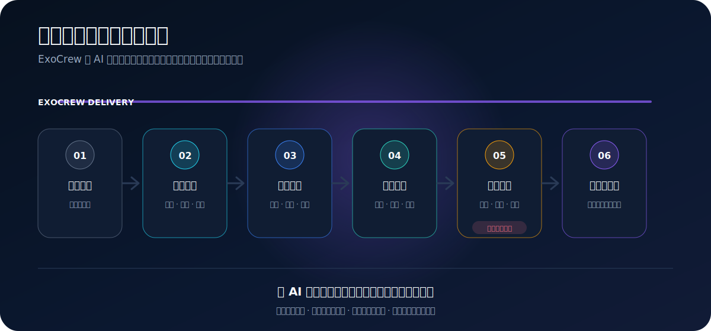
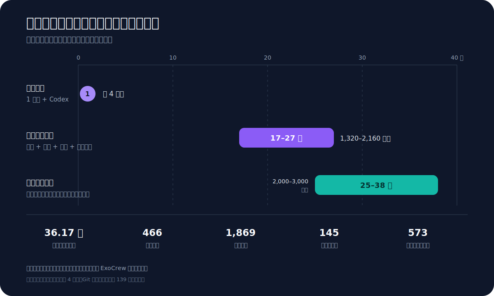

<div align="center">

# ExoCrew

### AI 时代的交付外骨骼

## 装上你还没有的那支团队。

**一个不懂代码的人，用 Codex，在约四个月里把一套复杂企业业务系统真正推到了生产。**

现在，我把这四个月踩过的坑、建立的门禁和跑通的交付方法，全部装进你的 AI 工作流。

**不是多一份提示词。是一支会追问需求、守住架构、怀疑测试、敬畏上线的 AI 交付团队。**

<p>
  <a href="https://github.com/denelwu-GH/exocrew/actions/workflows/quality-gates.yml"></a>
  
  
  
  <a href="LICENSE"></a>
</p>

**[30 秒安装](#30-秒安装) · [看看装上了谁](#五个角色一条交付链) · [查看真实证据](#不只讲故事直接看证据) · [English](README.md)**

</div>



<p align="center"><strong>一个人负责愿景，ExoCrew 让 AI 开始像一支完整团队那样交付。</strong></p>

## AI 会写代码，但不会替你守住整个项目

真正困难的，从来不是让 AI 写出一个页面。

困难的是：

- 需求改变时，它还记不记得业务边界；
- 代码越来越多时，架构会不会失控；
- 测试显示通过时，关键链路是不是真的可用；
- 数据、迁移和发布出问题时，有没有回滚的路；
- 一个任务做完以后，结论能不能留给下一次继续使用。

**你缺的不是更多代码。你缺的是一支能够把代码带到真实交付的团队。**

## 五个角色，一条交付链

| 角色 | Skill | 装上以后，它会帮你 |
|---|---|---|
| 交付负责人 | `exocrew-delivery` | 把复杂任务从一句想法带到真正收口 |
| 产品经理 | `product-brief` | 让 AI 先想清楚用户、价值、边界和验收，再开始写 |
| 研发负责人 | `engineering-guardrails` | 守住架构、契约和单一真值，让项目继续生长而不是越写越乱 |
| 测试负责人 | `test-evidence` | 识别“看起来通过”的假绿，让结果有证据而不是靠感觉 |
| 运维负责人 | `safe-operations` | 让数据、迁移和发布始终有预演、有验证、有回头路 |

这不是五个聊天人格，而是五套能真正执行的交付动作。



## 30 秒安装

```bash
codex plugin marketplace add denelwu-GH/exocrew
codex plugin add exocrew@exocrew
```

安装后新建一个 Codex 任务，然后直接说：

```text
使用 $exocrew-delivery，把这个需求从模糊想法推进到可安全上线的交付。
先明确用户、边界和验收，再实施、验证、准备回滚并完成收尾。
```

## 这不是实验室方法

我不是程序员。

但借助 Codex，我在约四个月里独立推进出了一套真正上线、持续运行的复杂企业业务系统。它正在企业端承载日常运营、真实数据治理和企业业务信息推送。

Git 留痕横跨 139 个自然日，包含 1,869 次主线提交、25 个运营入口、401 个接口操作、125 个数据模型，以及完整的测试、迁移、发布、回滚和数据治理记录。

真正让我付出代价的，不是代码怎么写，而是几百次关于业务边界、架构漂移、假绿测试、历史数据和生产发布的真实踩坑。

**ExoCrew，就是这些代价留下来的可安装经验。**

## 不只讲故事，直接看证据

| 证据 | 已核验规模 | 证据 | 已核验规模 |
|---|---:|---|---:|
| Git 首尾留痕 | **139 天** | 主线提交 | **1,869 次** |
| 运行与测试源码 | **36.17 万行** | 测试文件 | **466 个** |
| 硬门禁 + 架构决策 | **90 + 249** | 操作手册 + 发布/修复复盘 | **64 + 573** |



如果由传统跨职能团队从零重建同等工作面，透明模型估算为 **1,320–2,160 人天**，相当于 **17–27 个产品、研发、测试和运维角色在同样约四个月内协作推进**。

## 适合哪些项目

ExoCrew 是行业无关、技术栈无关的通用交付框架，尤其适合：

- 一个人或小团队借助 AI 推进的真实产品；
- 企业后台、SaaS、内部工具和运营管理系统；
- 已经从“能运行”走到“不能再乱改”的复杂项目；
- 涉及真实数据、数据库迁移、持续测试和生产发布的软件。

## 更多使用方式

<details>
<summary><strong>单独安装 5 个 Skills</strong></summary>

克隆仓库后先预览，再明确执行：

```bash
node plugins/exocrew/scripts/install-skills.mjs
node plugins/exocrew/scripts/install-skills.mjs --apply
```

已有 Skill 默认不会被覆盖；显式使用 `--force` 时会先备份。

</details>

<details>
<summary><strong>为现有项目安装治理骨架</strong></summary>

```bash
node plugins/exocrew/scripts/bootstrap-project.mjs --target ./my-project
node plugins/exocrew/scripts/bootstrap-project.mjs --target ./my-project --apply
```

starter 会创建唯一决策源、任务态、硬约束、索引，以及工作日志、决策、发布和经验模板。

</details>

## 证据口径与当前边界

ExoCrew 来自真实生产系统的交付经验。上面的代码、测试、提交和治理数字来自绑定版本的只读审计；传统团队工作量是透明重建模型，不是工时审计，也不是安装后的提速承诺。ExoCrew 当前不宣称固定的提速倍数、缺陷下降比例或可替代人数，采用效果将通过公开的 30 任务配对 Benchmark 测量。

**[查看完整证据](docs/EVIDENCE.md) · [查看测算公式](docs/EFFORT_MODEL.md) · [查看 Benchmark](docs/BENCHMARK.md) · [查看架构](docs/ARCHITECTURE.md)**

---

<div align="center">

### 别再让一个 AI 同时假装产品、研发、测试和运维。

## 给它装上一支真正会协作的交付团队。

**[30 秒安装](#30-秒安装) · [查看五个角色](#五个角色一条交付链) · [给 ExoCrew 一个 Star](https://github.com/denelwu-GH/exocrew)**

MIT License

</div>
