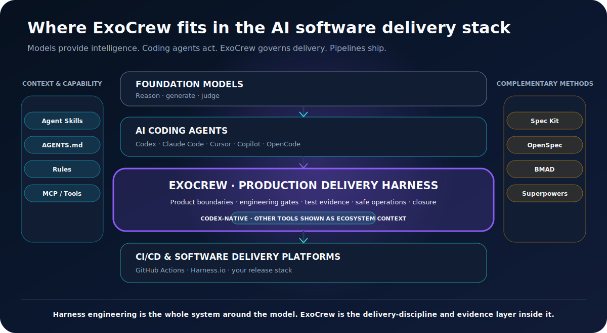

# What Is an AI Coding Agent Harness?

An **AI coding agent harness** is the engineered system around a model that helps it observe a repository, use tools, keep context, follow policies, verify changes, and continue until the work is actually complete.

A model can generate text and code. A coding agent can read files, edit a repository, run commands, and call tools. A harness makes that execution more reliable by shaping the loop around the model: context, instructions, permissions, tools, evidence, approval, memory, and stop conditions.

OpenAI describes **harness engineering** as the systems, scaffolding, repository knowledge, tools, and feedback loops that let coding agents do useful work with less human intervention. Microsoft similarly describes an agent harness as the runtime around a model that manages tool calls, context, policies, and multi-step progress.

## The AI software delivery stack

| Layer | Primary job | Examples |
|---|---|---|
| Foundation model | Reason, generate, and judge | OpenAI and Anthropic models |
| Coding-agent runtime | Inspect repositories, edit files, run commands, call tools | Codex, Claude Code, Cursor, GitHub Copilot, OpenCode |
| Context and capability mechanisms | Deliver reusable instructions, repository context, and external tools | Agent Skills, `AGENTS.md`, rules, MCP servers |
| Specification and development methods | Structure intent, plans, tasks, roles, and development practices | Spec Kit, OpenSpec, BMAD, Superpowers |
| Delivery-discipline layer | Protect boundaries, architecture, test evidence, operations, rollback, and closure | **ExoCrew** |
| CI/CD and software-delivery platform | Build, scan, approve, deploy, observe, and enforce pipelines | GitHub Actions, Harness.io, other release stacks |

## Where ExoCrew fits

ExoCrew is not a foundation model, coding-agent runtime, MCP server, or CI/CD platform. It is a **production delivery harness layer** packaged as six installable Codex skills:

1. `exocrew-delivery` coordinates scope, risk, evidence, and closure.
2. `product-brief` turns a vague request into users, value, boundaries, and acceptance.
3. `engineering-guardrails` protects architecture, contracts, and sources of truth.
4. `system-modernization` governs ports, rewrites, framework upgrades, parity, extraction, readiness, and replacement.
5. `test-evidence` matches verification depth to risk and rejects false-green evidence.
6. `safe-operations` governs data changes, migrations, releases, rollback, and post-verification.

These skills do not replace the coding agent. They change how the agent approaches delivery.

## Harness Engineering and Harness.io are different

The word **harness** is used in two relevant ways:

- **Harness Engineering** is a category: engineering the system around an AI agent so it has the right context, tools, policies, validation loops, and environment.
- **Harness.io** is a company and software-delivery platform offering CI/CD, governance, security, observability, and AI agents inside delivery pipelines.

ExoCrew belongs to the first conversation. It can prepare clearer scope, safer changes, stronger test evidence, and rollback-aware release packages before work enters a CI/CD platform. It is not a replacement for Harness.io.

## Why prompts are not enough

A one-off prompt disappears with the conversation. Serious software needs reusable behavior:

- rules that trigger for the right task;
- repository context that survives across sessions;
- explicit approval before risky changes;
- tests that prove behavior rather than merely execute;
- a safe way back before data or release actions;
- durable decisions, worklogs, runbooks, and evidence.

Agent Skills and repository instructions are useful mechanisms for carrying that behavior. ExoCrew supplies a production-distilled delivery system through those mechanisms.

## When you need a delivery harness

You probably need one when:

- the project has moved beyond a demo;
- AI changes affect multiple modules or business rules;
- tests pass but you still do not trust the result;
- the system has real data, migrations, users, or production releases;
- decisions are repeatedly lost between tasks;
- one person is covering product, engineering, modernization, test, and operations.
- an old system is being ported, modernized, replaced, or distilled into a clean reusable core.

## Is ExoCrew cross-agent compatible?

ExoCrew is **packaged, installed, and validated for Codex today**. Its `SKILL.md`-based structure follows the broader Agent Skills pattern, but native installers and behavior validation for Claude Code, Cursor, GitHub Copilot, OpenCode, and other agents have not been published yet. They are ecosystem neighbors in this documentation, not claimed integrations.

## Official references

- [OpenAI: Harness engineering](https://openai.com/index/harness-engineering/)
- [Microsoft: Agent harnesses](https://learn.microsoft.com/en-us/agent-framework/agents/harness)
- [OpenAI Codex](https://openai.com/codex/)
- [GitHub: About Agent Skills](https://docs.github.com/en/copilot/concepts/agents/about-agent-skills)
- [Anthropic: Skills](https://platform.claude.com/docs/en/managed-agents/skills)
- [Cursor: Rules](https://docs.cursor.com/context/rules-for-ai)
- [Harness: Worker Agents](https://developer.harness.io/docs/platform/harness-ai/harness-agents/)
