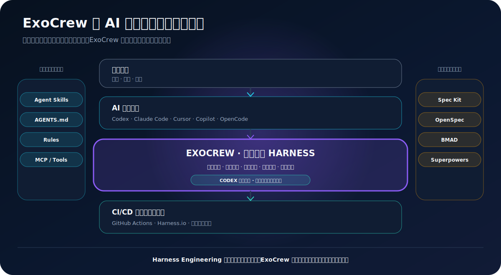

# 什么是 AI 编程代理 Harness？

**AI 编程代理 Harness**，可以理解为模型周围的一整套工程系统：帮助它读取项目、调用工具、保持上下文、遵守权限与规则、验证改动，并持续推进到任务真正完成。

模型可以生成文字和代码。AI 编程代理可以读取文件、修改仓库、执行命令和调用工具。而 Harness 负责把这些能力组织成更可靠的执行循环，包括上下文、指令、权限、工具、证据、审批、记忆与停止条件。

OpenAI 用 **Harness Engineering** 描述围绕 Coding Agent 建立系统、脚手架、仓库知识、工具和反馈循环的工程实践。Microsoft 也把 Agent Harness 定义为包裹在模型外部、负责工具调用、上下文、策略和多步骤推进的运行系统。

## AI 软件交付的几个层级

| 层级 | 主要职责 | 常见例子 |
|---|---|---|
| 基础模型 | 推理、生成和判断 | OpenAI、Anthropic 模型 |
| AI 编程代理 | 阅读仓库、修改文件、执行命令、调用工具 | Codex、Claude Code、Cursor、GitHub Copilot、OpenCode |
| 上下文与能力机制 | 提供可复用指令、项目知识和外部工具 | Agent Skills、`AGENTS.md`、Rules、MCP Servers |
| 规格与开发方法 | 组织需求、计划、任务、角色和开发流程 | Spec Kit、OpenSpec、BMAD、Superpowers |
| 交付纪律层 | 守住边界、架构、测试证据、运维安全、回滚和收口 | **ExoCrew** |
| CI/CD 与软件交付平台 | 构建、扫描、审批、部署、观测和流水线执行 | GitHub Actions、Harness.io、其它发布体系 |

## ExoCrew 在哪里起作用

ExoCrew 不是基础模型、Coding Agent Runtime、MCP Server 或 CI/CD 平台。它是一个以 5 个 Codex Skills 交付的**生产交付 Harness 层**：

1. `exocrew-delivery`：统筹范围、风险、证据与收口。
2. `product-brief`：把一句模糊需求变成用户、价值、边界和验收标准。
3. `engineering-guardrails`：守住架构、契约和单一真值。
4. `test-evidence`：让验证深度匹配风险，并拒绝假绿证据。
5. `safe-operations`：治理数据变更、迁移、发布、回滚和上线后验证。

这些 Skills 不替代编程代理，而是改变编程代理完成交付的方式。

## Harness Engineering 和 Harness.io 不是一回事

`Harness` 在这里有两个不同含义：

- **Harness Engineering** 是一个工程类目：围绕 AI Agent 设计上下文、工具、规则、验证循环和运行环境。
- **Harness.io** 是一家企业软件公司及其软件交付平台，提供 CI/CD、治理、安全、可观测性，以及运行在交付流水线中的 AI Agents。

ExoCrew 属于第一个语境。它帮助 AI 在进入 CI/CD 之前形成更清晰的范围、更安全的改动、更可信的测试证据和可回滚的发布包。它不是 Harness.io 的替代品。

## 为什么一段 Prompt 不够

一次性 Prompt 会随着对话结束而消失。真实软件需要可复用的执行方式：

- 在正确任务出现时自动触发相应规则；
- 跨任务保留项目上下文；
- 风险操作前要求明确审批；
- 用测试证明行为，而不只是把命令跑一遍；
- 数据或发布操作前准备回滚；
- 把决策、worklog、runbook 和证据留给下一次任务。

Agent Skills 和仓库指令是承载这些行为的机制，ExoCrew 提供的是从真实生产项目中提炼出的交付内容。

## 哪些时候需要 Delivery Harness

当你遇到以下情况时，通常已经需要：

- 项目不再只是 Demo；
- AI 的一次改动会影响多个模块或业务规则；
- 测试显示通过，但你仍不敢相信结果；
- 系统开始承载真实数据、迁移、用户或生产发布；
- 每次新任务都要重新解释之前的决定；
- 一个人正在同时覆盖产品、研发、测试和运维。

## ExoCrew 能直接安装到其它 Agent 吗？

ExoCrew 当前已经完成 **Codex 的打包、安装和验证**。它使用的 `SKILL.md` 结构符合更广泛的 Agent Skills 方向，但 Claude Code、Cursor、GitHub Copilot、OpenCode 等平台的原生安装器和行为验证尚未发布。因此它们在本文中是生态坐标，不是已经宣布的原生集成。

## 官方资料

- [OpenAI：Harness Engineering](https://openai.com/index/harness-engineering/)
- [Microsoft：Agent Harnesses](https://learn.microsoft.com/en-us/agent-framework/agents/harness)
- [OpenAI Codex](https://openai.com/codex/)
- [GitHub：Agent Skills](https://docs.github.com/en/copilot/concepts/agents/about-agent-skills)
- [Anthropic：Skills](https://platform.claude.com/docs/en/managed-agents/skills)
- [Cursor：Rules](https://docs.cursor.com/context/rules-for-ai)
- [Harness：Worker Agents](https://developer.harness.io/docs/platform/harness-ai/harness-agents/)
